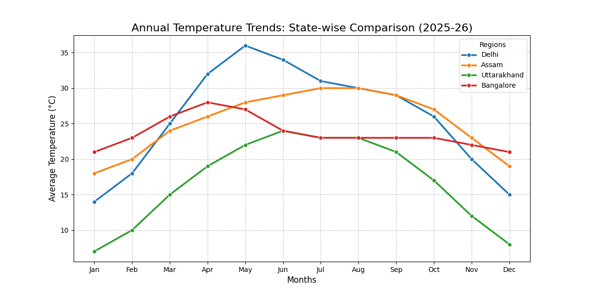
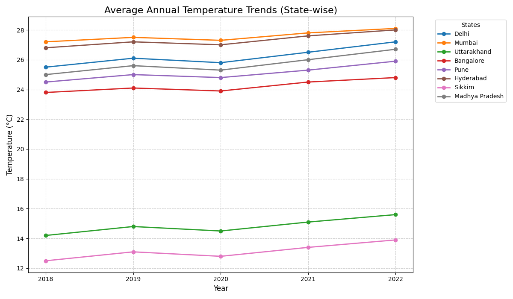

# Indian Weather Data Analytics

This repository contains Python-based data analysis projects focused on temperature trends across various Indian states.

---

## 1. Comparative Climate Analysis (Selective States)
**Script:** `Weather1.py`  
**Description:** This project analyzes and compares the annual temperature trends of four distinct regions (Delhi, Assam, Uttarakhand, and Bangalore) to visualize different climatic zones.

### Visual Report:

---

## 2. Multi-State Weather Trend Analysis
**Script:** `weather.py`  
**Description:** A more comprehensive analysis covering a wider range of states including Mumbai, Pune, Hyderabad, Sikkim, and Madhya Pradesh, providing a broader look at India's temperature variations.

### Visual Report:

---
*Developed by Rituraj Goswami*
